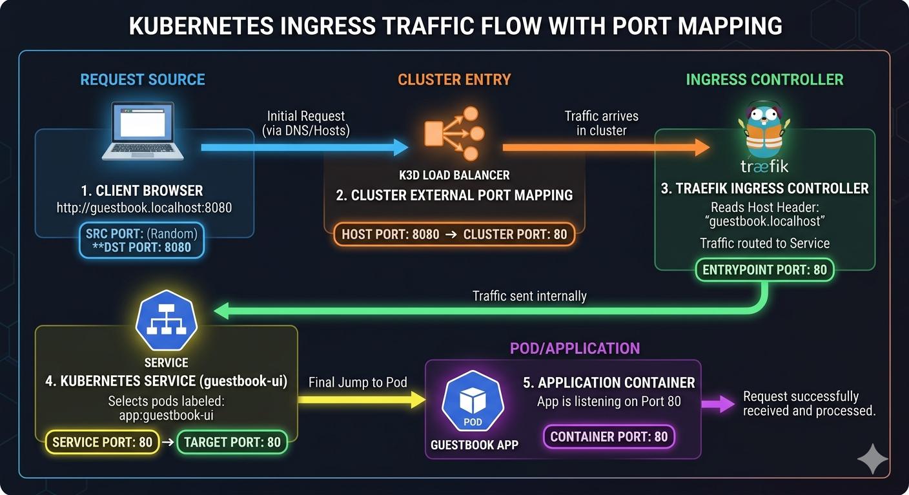
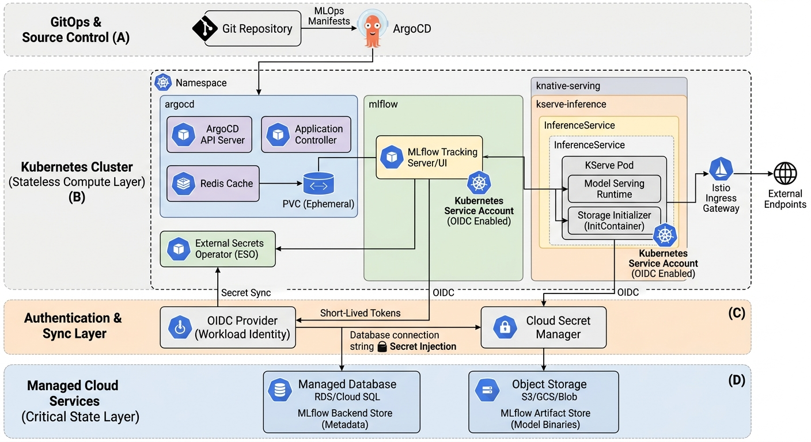

### k3d init
```sh
curl -s https://raw.githubusercontent.com/k3d-io/k3d/main/install.sh | bash
# create cluster with port mapping: client:8080 to loadbalancer:80
k3d cluster create mlops --agents 1 -p "8080:80@loadbalancer"
```

### argocd-cli
```sh
curl -sSL -o argocd-linux-amd64 https://github.com/argoproj/argo-cd/releases/latest/download/argocd-linux-amd64
chmod +x argocd-linux-amd64
sudo mv argocd-linux-amd64 /usr/local/bin/argocd
```

### argocd
```sh
kubectl create namespace argocd
# server-side for server side apply with large manifest 
kubectl apply --server-side -n argocd -f https://raw.githubusercontent.com/argoproj/argo-cd/stable/manifests/install.yaml

# make sure argocd is listening on 80 (http)
kubectl apply -f argocd-cm-insecure.yaml
kubectl rollout restart deployment argocd-server -n argocd

# traefik route to service argocd-server:80
kubectl apply -f argocd-ingress.yaml
echo 127.0.0.1 argocd.localhost >> \etc\hosts

argocd admin initial-password -n argocd
argocd login argocd.localhost:8080 --username admin --insecure --plaintext --grpc-web
```

### app test
from path of repo with deployment+svc.yaml, chart.yaml (helm) or kustomization.yaml
```sh
argocd app create guestbook \
--repo https://github.com/argoproj/argocd-example-apps.git \
--path guestbook \
--dest-server https://kubernetes.default.svc \
--dest-namespace default

argocd app list

argocd app sync guestbook

argocd app delete guestbook --cascade
```


### gitea (local git)
```sh
kubectl create namespace gitea
kubectl apply -f mlops-config/infrastructure/gitea/gitea-app.yaml 
kubectl apply -f mlops-config/infrastructure/gitea/gitea-ingress.yaml 

echo 127.0.0.1 gitea-http.gitea.svc.cluster.local >> \etc\hosts

argocd repo add http://gitea.k3d.localhost/admin/ml-infra-config.git --username admin --password <your-password>
```

### ml infra config
create argocd manifest repo to start: 

```sh
kubectl apply -f ml-infra-config/bootstrap/argocd-projects.yaml # track projects folder for project
kubectl get appprojects -n argocd

kubectl apply -f ml-infra-config/bootstrap/infra-apps.yaml # track infrastructure folder for infra tools

# project based app deployment
kubectl apply -f ml-infra-config/bootstrap/default-apps.yaml # track services/default-project
```

### kserve
https://github.com/kserve/kserve.git/charts:
- crds
- resources
- runtimes: --set kserve.servingruntime.enabled=true 

### kserve inference service
Inside the cluster, other pods can reach this service at:
[http://sklearn-iris-predictor.default.svc.cluster.local]()

`svc/sklearn-iris-predictor-default` is the full identifier for the service object in your cluster:
- svc/: This tells kubectl you are looking for a Service resource.
- sklearn-iris: The name you gave your isvc in metadata.name.
- predictor: The component of the isvc (KServe can also have transformer or explainer components).
- default: ~~The namespace where the service lives.~~ (no need in kserve raw deployment)

Portforward:
```sh
# kubectl port-forward svc/<service-name> <local-port>:<service-port>
kubectl port-forward svc/sklearn-iris-predictor 8081:80 -n default
```

Endpoint: KServe expects a specific URL (**Open Inference Protocol**) path to handle the prediction request: 
`/v2/models/sklearn-iris/infer`

Then use [http://localhost:8081/v2/models/sklearn-iris/infer]() to hit the model
```sh
curl -v http://localhost:8081/v2/models/sklearn-iris/infer \
-H "Content-Type: application/json" \
-d @- <<EOF
{
  "inputs": [
    {
      "name": "input-0",
      "shape": [2, 4],
      "datatype": "FP32",
      "data": [
        [6.8, 2.8, 4.8, 1.4],
        [6.0, 3.4, 4.5, 1.6]
      ]
    }
  ]
}
EOF
```

### Auth and Secrets


1. MLflow Components
MLflow tracks your training, stores your model artifacts, and serves as your Model Registry.

| Component | What it does | Where to run it | Why |
| :--- | :--- | :--- | :--- |
| **MLflow Tracking UI / Server** | The web dashboard and REST API endpoint that data scientists and pipelines interact with. | **In-Cluster (Deployment)** | Stateless compute. It scales horizontally based on traffic and can be managed completely via ArgoCD. |
| **Backend Store** | Stores experiment metadata, run parameters, metrics, and model version text logs. | **Cloud Managed DB** *(RDS / Cloud SQL)* | **Critical State.** A relational database needs automatic backups, high availability, and multi-AZ failover that cloud providers manage flawlessly. |
| **Artifact Store** | Stores the heavy physical binaries (e.g., `.pkl`, `.onnx`, weights, and environment files). | **Cloud Object Storage** *(S3 / GCS)* | **Critical State.** Infinite scaling, zero maintenance, and allows KServe to pull models directly without putting load on the MLflow server. |

2. ArgoCD Components
ArgoCD handles the declarative GitOps deployment of your entire stack (including MLflow and KServe manifests).

| Component | What it does | Where to run it | Why |
| :--- | :--- | :--- | :--- |
| **ArgoCD API Server** | Powers the Web UI, CLI, and handles authentication/RBAC. | **In-Cluster (Deployment)** | Stateless API layer. |
| **Application Controller** | The brains. It continuously compares the live state of the cluster with the desired state in your Git repo. | **In-Cluster (StatefulSet)** | Compute-heavy. It needs to run inside the cluster to have low-latency access to the Kubernetes API server. |
| **Repo Server** | Maintains a local cache of your Git repositories and generates Kubernetes manifests from Helm/Kustomize. | **In-Cluster (Deployment)** | Stateless worker that can be scaled up if you have hundreds of Git repos. |
| **Redis Cache** | Caches Git manifests and cluster states so ArgoCD doesn't rate-limit your GitHub/GitLab account. | **In-Cluster (PVC / Ephemeral)** | **Low-risk State.** While it uses a volume, the data is entirely disposable. If Redis dies, ArgoCD simply clones the Git repo again and rebuilds the cache. |

3. KServe Components
KServe provides highly scalable, serverless model inference. It relies heavily on a Cloud-Native Serverless framework (typically Knative) and a Service Mesh (Istio or Linkerd).

| Component | What it does | Where to run it | Why |
| :--- | :--- | :--- | :--- |
| **KServe Controller Manager** | Watches for `InferenceService` CRDs and orchestrates the creation of serving pods, routing, and scaling. | **In-Cluster (Deployment)** | Core control plane compute. |
| **Storage Initializer** | An init-container that runs right before your model starts. It downloads the actual model weights from your Cloud Object Store (S3). | **In-Cluster (Pod Init-Container)** | Short-lived compute task that requires cloud IAM permissions to read from your S3 bucket. |
| **Model Webhook** | Injects sidecars and variables into serving pods when they are created. | **In-Cluster (Deployment)** | Standard Kubernetes extension mechanism. |
| **Knative Serving** *(Dependency)* | Manages the serverless autoscaling (including scaling down to absolute zero pods if there's no traffic). | **In-Cluster (Deployments)** | Micro-management compute layer for scaling pods up and down. |
| **Istio Service Mesh** *(Dependency)* | Handles ingress routing, canary deployments (e.g., splitting traffic 90/10 between model versions), and mTLS security. | **In-Cluster (DaemonSets/Deployments)** | Network routing infrastructure that *must* live co-located on your cluster nodes. |

### todo
- terraform for argocd
- argocd manifest for kserve + prometheus + grafana
- github actions
- kserve custom runtimes
- split ml-infra-config and ml-apps-config into 2 repos


